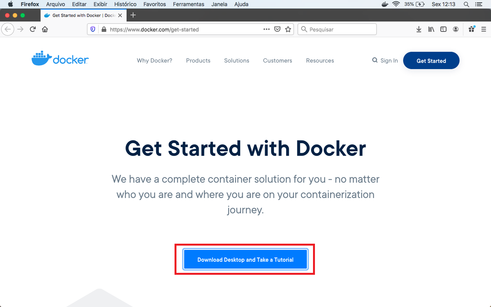
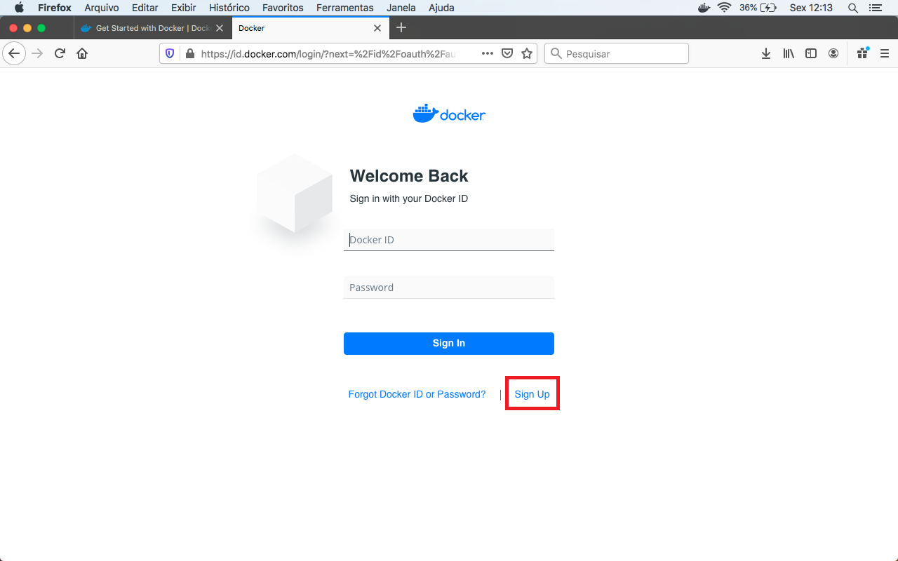
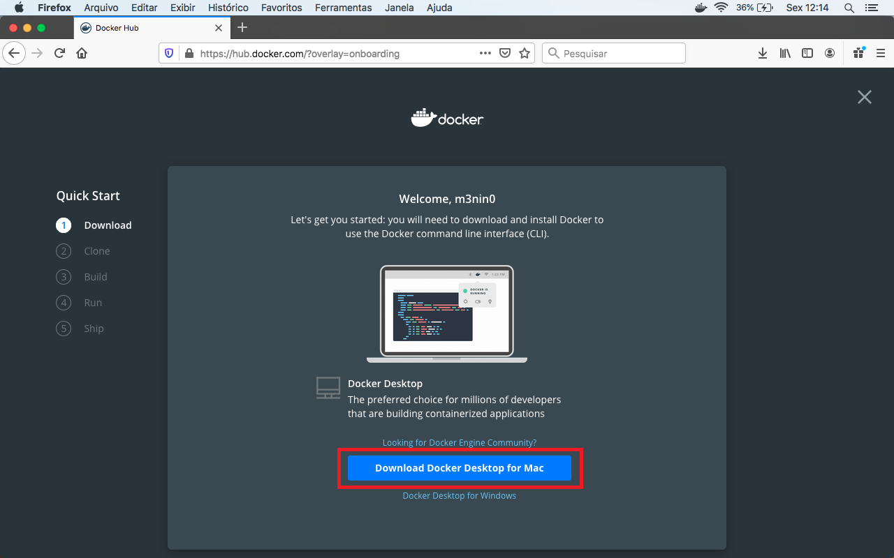
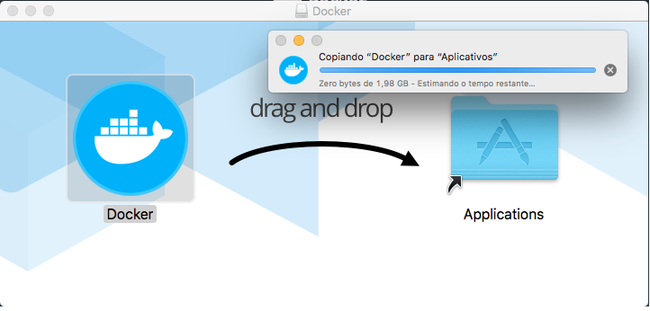
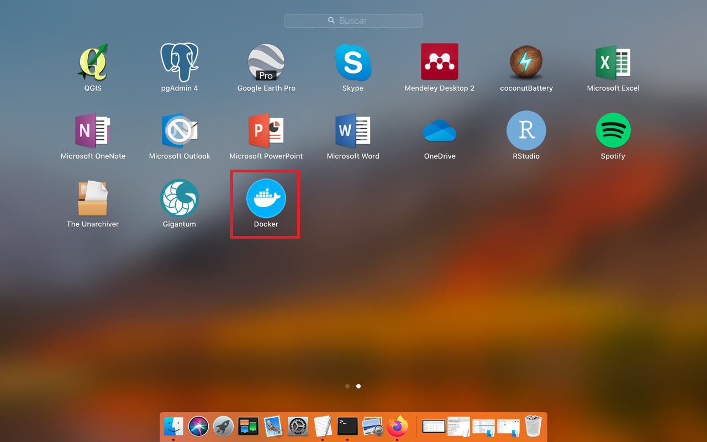
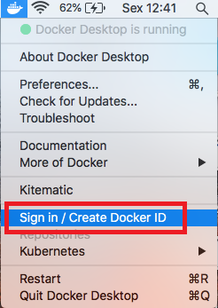

# Instalação do Docker para MacOS

A instalação do Docker em ambiente MacOS é apresentada nas etapas abaixo. 

## Instalação do Docker

**1.** Para iniciar, acesse a [página de *download* do Docker](https://www.docker.com/get-started). Nesta página, clique na opção `Download Desktop and Take a Tutorial`:

**2.** Ao clicar neste botão, você será redirecionado para a página de *login* do DockerHub. Caso precise criar uma conta, utilize a opção `Sign Up`:

**3.** Após fazer o *login*, a página a qual você será direcionado possui o botão `Download Docker Desktop for Mac`, clicando neste você já estará realizando o *download* do instalador:

**4.** Com o final do *download*, faça a execução do `dmg` e começe o processo de instalação:

**5.** Após o processo de instalação ser finalizado, abra sua aba de aplicações, busque pelo Docker e faça sua inicialização:

**6.** Depois que rede inicializar você verá o icone do Docker, clique neste icone com o botão direito, selecione `Sign in / Create Docker ID` e faça seu login:

> Para acessar imagens a partir do Docker Hub é necessário realizar o login.