# Instalação do Docker para Microsoft Windows 

Este documento apresenta os passos para instalação e configuração do Docker para o Microsoft Windows.
A instalação do Docker pode ser realizada apenas em sistemas de arquiteura 64-bits e o com suporte a tecnologia de virtualização de hardware.

 Para verificar se a virtualização é suportada pelo seu sistema, abra o Prompt de Comando e execute o comando abaixo:

```bash
    systeminfo
```

Verifique na seção `Requisitos do Hyper-V` se a virtualização do firmware está habilitada. Se sim, uma saída semelhante à apresentada abaixo poderá ser visualizada no terminal.

```bash
Requisitos do Hyper-V:  Extensão de Modo de Monitor VM: Sim
                            Virtualização Habilitada no Firmware: Sim
                            Conversão de Endereços de Segundo Nível: Sim
                            Prevenção de Execução de Dados Disponível: Sim
```

    
**Obs**: Após a execução do comando, se a seção `Requisitos do Hyper-V`  não for apresentada, o seu *hardware* não possuí suporte a virtualização. Dessa forma, o **Docker não poderá ser instalado**.


A instalação não é igual para todas as versões do Windows.
Por tanto, verifique a versão de seu sistema operacional e escolha abaixo o tutorial corresponte.


* [Windows 10 Professional, Enterprise e Education](#Instalação-do-Docker-para-Windows-10-Professional,-Enterprise-e-Education)
* [Windows 10 Home ou inferior](#Instalação-do-Docker-no-Windows-10-Home-ou-Inferior)

## Instalação do Docker para Windows 10 Professional, Enterprise e Education

**1.** Acesse a [página de *download* do Docker](https://www.docker.com/get-started) e selecione a opção `Download Desktop and Take a Tutorial`:

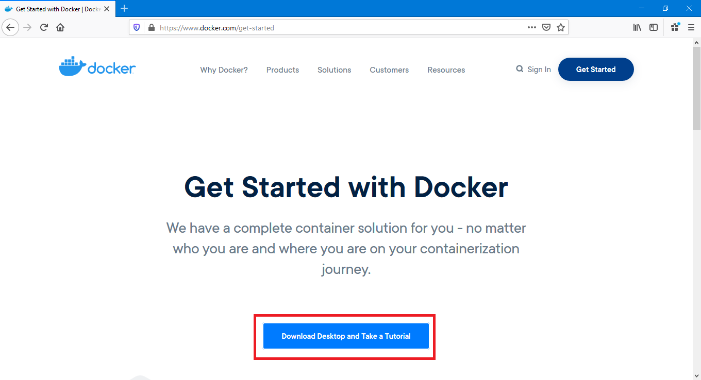

**2.** Você será redirecionado para a página de *login* do DockerHub. Para realizar o download do instalador, é necessário possuir uma conta de usuário no DockerHub. Se você ainda não estiver cadastrado, utilize a opção `Sign Up` como indicado na figura:

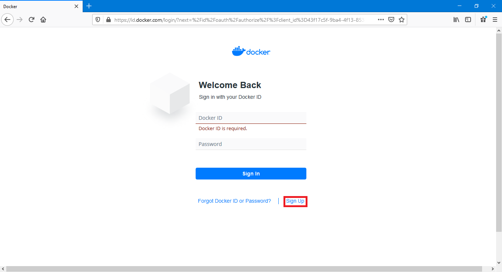

**3.** Na página de cadastro preencha as informações requisitadas e finalize o processo para Download e uso do Docker.

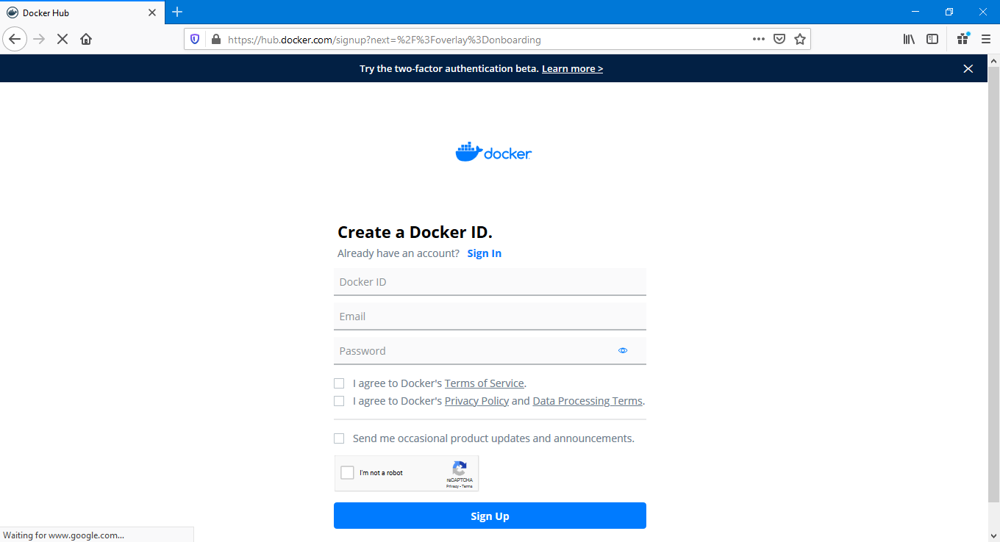

**4.** Realizado o *login* selecione a opção `Download Docker Desktop for Windows` como indicado abaixo:

<!-- , clicando neste você já estará realizando o *download* do instalador -->

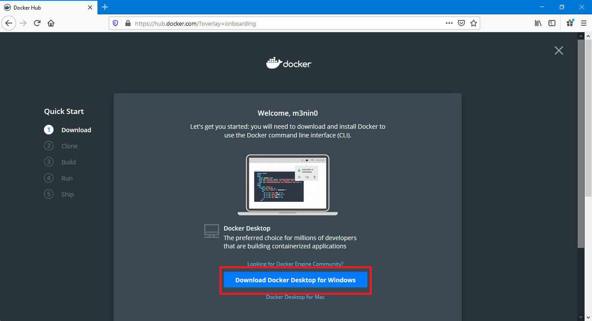

**5.** Será apresentada uma janela como mostrado na imagem. Pressione `Save File` para iniciar o download.

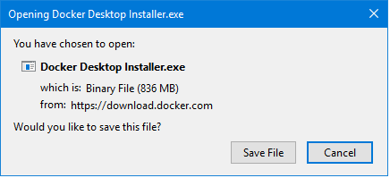

**6.** Com o *download* finalizado, acesse o diretório Downloads e execute instalador `Docker Desktop Installer`.

<!-- Com o final do *download*, execute o arquivo `Docker Desktop Installer`: -->

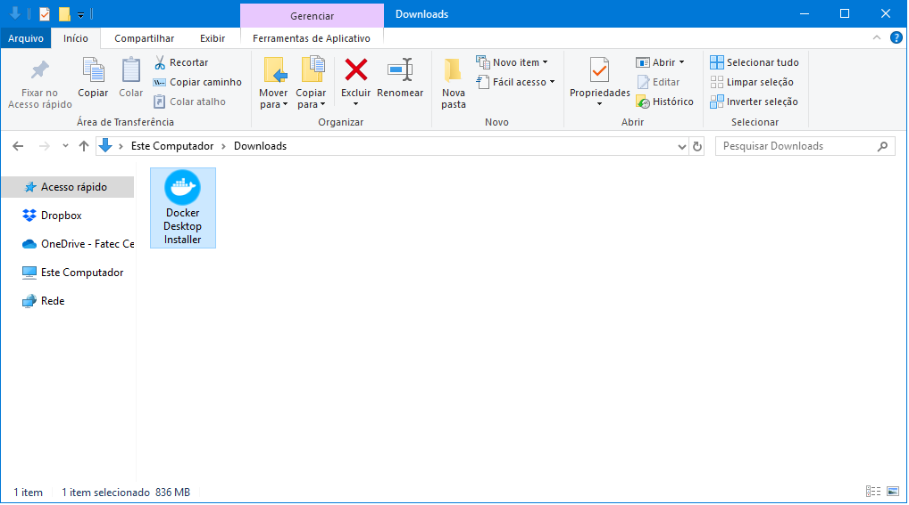 

**7.** Com o instalador iniciado, será realizado um processo de download dos pacotes necessários para a instalação da aplicação.

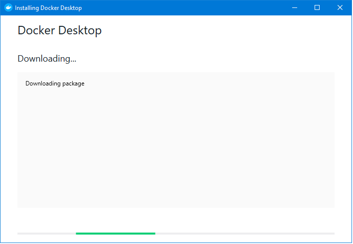

**8.** Com os pacotes baixados, algumas opções de instalação serão exibidas. Selecione somente a opção `Add shortcut to desktop` e pressione `OK` para continuar.

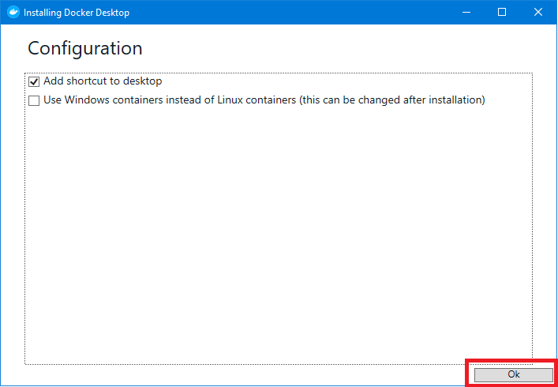

**9.** Essa janela mostra apenas que o processo de instalação encontra-se em progresso.


**10.** Ao final da instalação uma janela como mostrada abaixo será apresentada. Presisone `Close` para finalilzar a instalação:

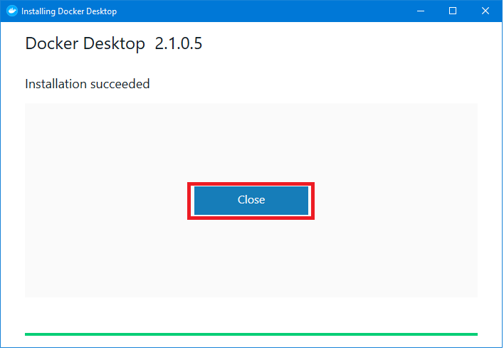 

**11.** Com o processo finalizado, faça a execução do Docker através do atalho na Área de trabalho ou no menu:


Se o processo de instalação foi realizado com sucesso, o seguinte *pop-up* será apresentado. Aguarde alguns instantes até que o processo de inicialização do Docker seja concluído. 

<!-- Ao iniciar a execução do Docker, o seguinte *pop-up* será apresentado. Aguarde alguns instantes  indicando que tudo foi instalado com sucesso: -->

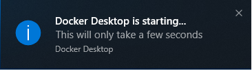

**12.** Com o Docker em execução uma janela de *login* será apresentada. Preencha com suas informações e conclua o processo de configuração.

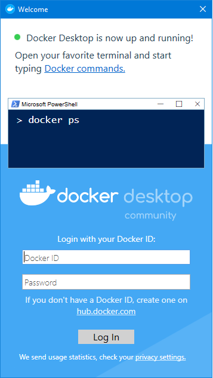

<!-- > Para acessar imagens a partir do Docker Hub é necessário realizar o login. -->

## Instalação do Docker no Windows 10 Home ou inferior

<!-- 
 executar o Docker corretamente, o seu sistema operacional Windows precisa ser da arquitetura 64-bits e a virtualização precisa estar habilitada. Siga os passos abaixo para verificar se o seu sistema atende estes requisitos:

* Para verificar a arquitetura do sistema, abra o Prompt de Comando e execute o código abaixo:
    ```bash
    wmic os get osarchitecture
    ```
    
    Caso o resultado do prompt retorne a mensagem **OSAcrchitecture 64 bits**, semelhante ao resultado abaixo, então o seu sistema é de 64 bits:
    ```bash
    OSArchitecture
    64 bits
    ```

* Para verificar se a virtualização está habilitada, 
    ```bash
    systeminfo ```
    Provavelmente, você irá ver uma seção de **Requisitos do Hyper-V**, como demonstra o resultado abaixo:
    
    -->


**1.** Para realizar o download do instalador Docker, acesse o link abaixo:

```text
https://github.com/docker/toolbox/releases/download/v19.03.1/DockerToolbox-19.03.1.exe
```

**2.** Após concluir o *download*, abra o instalador `Docker Toolbox`:

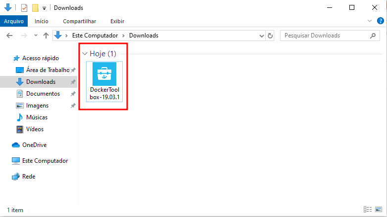

**3.** Uma janela semelhante a imagem abaixo será aberta. Mantenha as configurações padrões e pressione `Next` até que uma janela semelhante a apresentada no item 4 seja exibida:

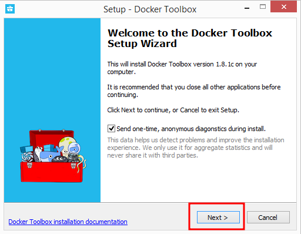

<!-- 
**4.** Escolha o botão **Next** para aceitar todas as configurações padrões e então instalar o Docker Toolbox. Caso seja solicitado permissão através de uma janela de segurança do Windows, permita para que o instalador faça as alterações necessárias. -->

**4.**  Ao final da instalação, uma janela semelhante a apresentada abaixo será exibida. Pressione `Finish` para concluir a instalação:

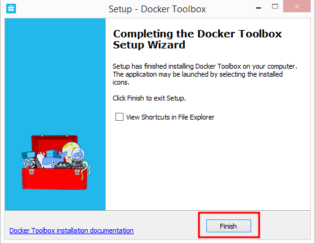


**5.** Na área de trabalho, serão adicionados três ícones relacionados a instalação do Docker. Procure pela aplicação **Docker QuickStart Terminal** e clique no ícone indicado abaixo. 

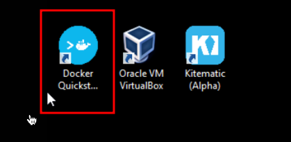

**6.**  Será aberto um terminal Docker Toolbox semelhante  o apresentado na imagem abaixo. Aguarde alguns instantes para que configuração e inicialização do Docker seja concluída.


**7.** Para verificar se a instalação foi concluída com sucesso, execute no terminal o comando abaixo:

```bash
docker run hello-world
```

**8.** Se tudo estiver funcionando corretamente, o  terminal irá apresentar uma saída como mostrada abaixo:

```bash
 $ docker run hello-world
 Unable to find image 'hello-world:latest' locally
 Pulling repository hello-world
 91c95931e552: Download complete
 a8219747be10: Download complete
 Status: Downloaded newer image for hello-world:latest
 Hello from Docker.
 This message shows that your installation appears to be working correctly.

 To generate this message, Docker took the following steps:
  1. The Docker Engine CLI client contacted the Docker Engine daemon.
  2. The Docker Engine daemon pulled the "hello-world" image from the Docker Hub.
     (Assuming it was not already locally available.)
  3. The Docker Engine daemon created a new container from that image which runs the
     executable that produces the output you are currently reading.
  4. The Docker Engine daemon streamed that output to the Docker Engine CLI client, which sent it
     to your terminal.

 To try something more ambitious, you can run an Ubuntu container with:
  $ docker run -it ubuntu bash

 For more examples and ideas, visit:
  https://docs.docker.com/userguide/
```


**Observação:** Mais informações sobre a instalação podem ser encontradas em: [Docker](https://docs.docker.com/install/).