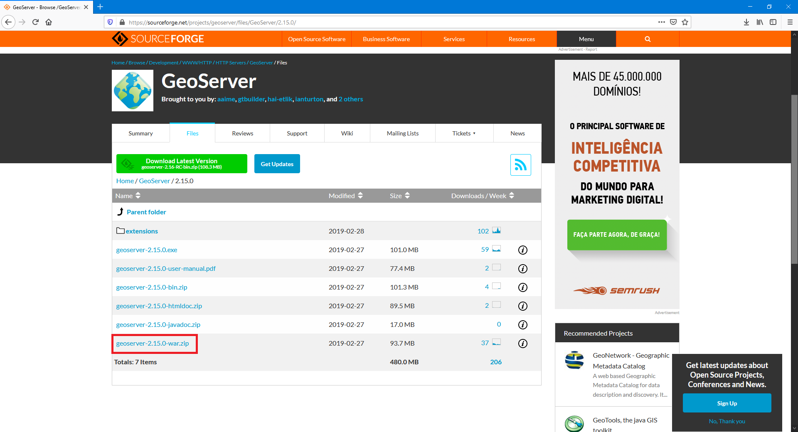
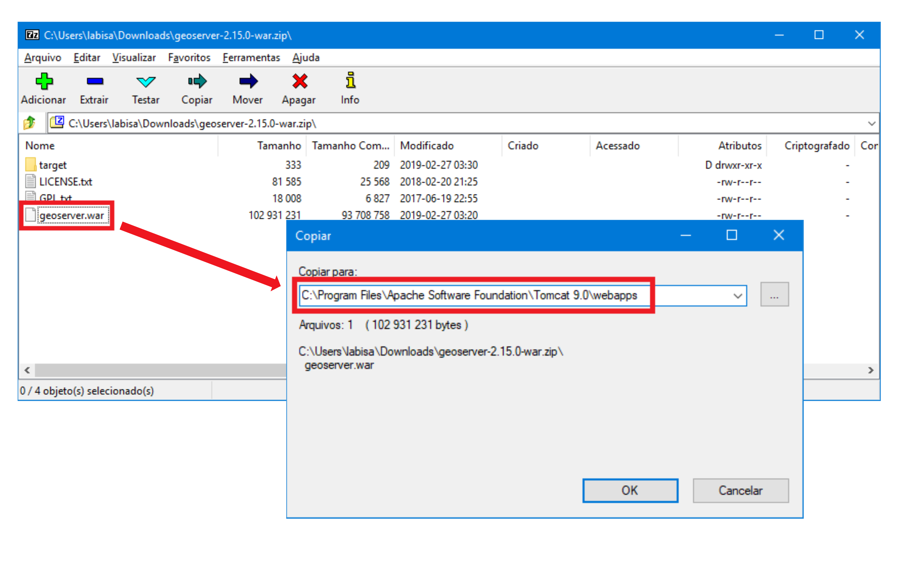
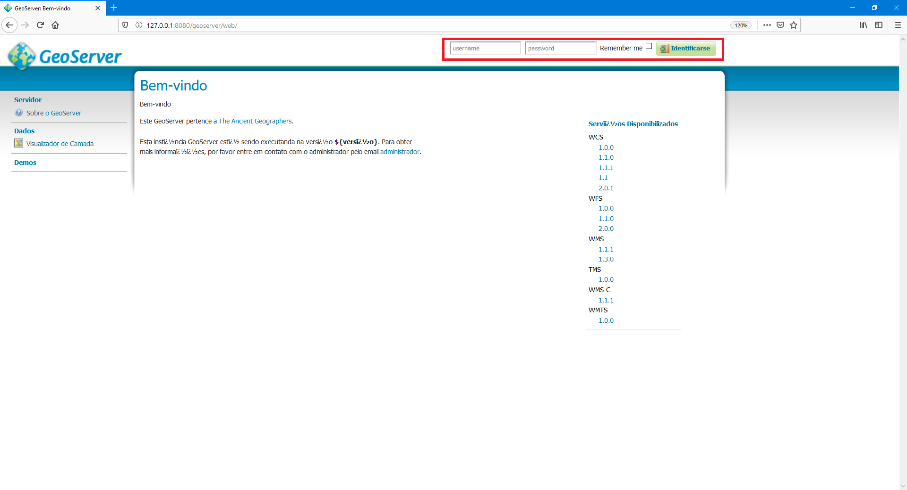
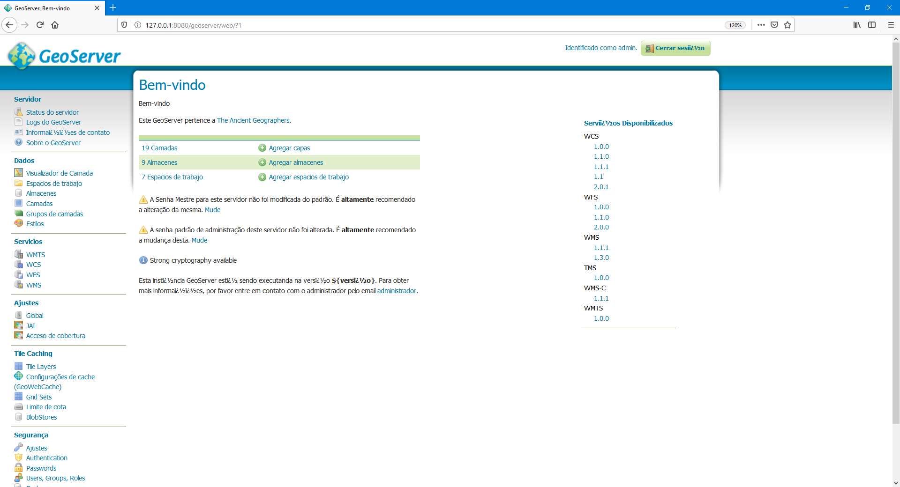

# Instalação do GeoServer para Microsoft Windows 10

> Para seguir esses passos é necessário que o Apache Tomcat já tenha sido instalado em sua máquina. Caso você não tenha instalado o Apache Tomcat, [consulte esta página](../tomcat/install-windows-10.md).

Antes de iniciar a instalação do GeoServer, certifique-se de que o Apache Tomcat esteja parado. Para interromper o Apache Tomcat, acesse o ícone do Apache Monitor, na barra de tarefas do Windows, clicando com o botão direito e selecionando a opção `Stop service`, como apresentado abaixo:

A instalação do GeoServer é feita através de um arquivo de *deploy* (`.war`). Faça o download deste arquivo no seguinte link: [`geoserver-2.15.0-war.zip`](https://sourceforge.net/projects/geoserver/files/GeoServer/2.15.0/).

Após baixar o arquivo, descompacte o arquivo `zip` e copie o arquivo `geoserver.war` para o diretório `webapps`, que está no local de instalação do Apache Tomcat.

Após copiar o arquivo acima para a pasta de aplicações do Apache Tomcat, você deverá reiniciar o Tomcat:

Para testar sua instalação, abra o navegador e acesse o seguinte endereço: [http://127.0.0.1:8080/geoserver](http://127.0.0.1:8080/geoserver). A página de administração do geoserver deverá ser exibida.

 
 
A credencial padrão do GeoServer é a seguinte:
  - **Usuário:** admin
  - **Senha:** geoserver

Ao fazer o login, a seguinte página será exibida, indicando que as atividades com o GeoServer podem ser iniciadas.

