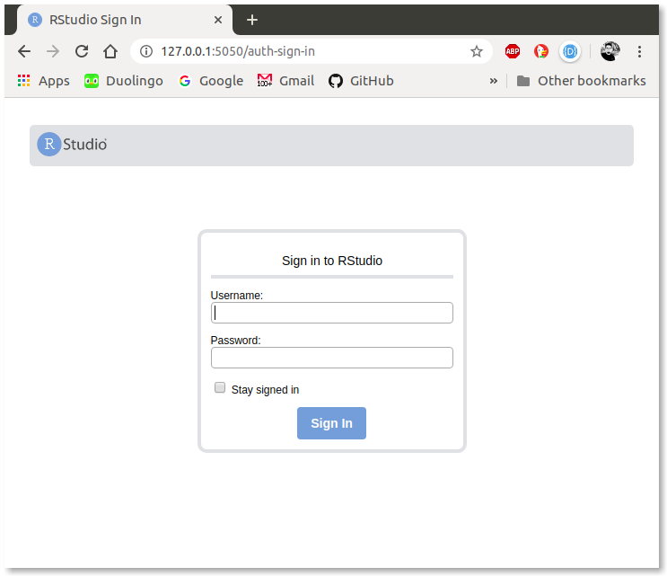
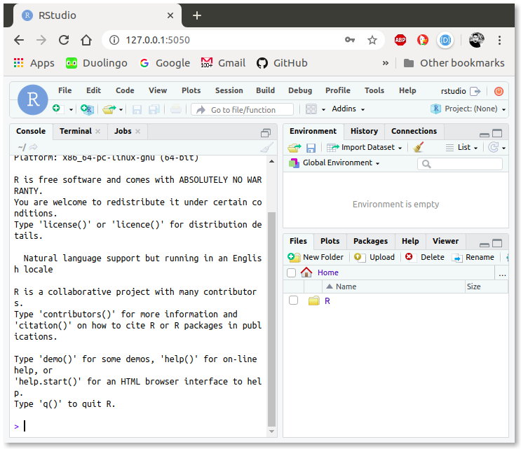
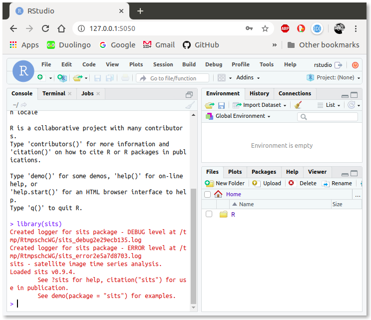

# Instalação do RStudio e sits com Docker

Pré Requisito:
* Docker

Atualmente, há uma imagem pré-configurada com o RStudio e o pacote sits disponível no DockerHub. Abaixo, serão apresentadas as etapas para realizar o download e a execução dessa imagem usando o Docker.

## Processo de download e execução da imagem rstudio-sits

**1.** Inicialmente, é necessário baixar a imagem **rstudio-sits:0.9.5** para a máquina local usando o seguinte comando abaixo em um terminal Linux ou Prompt de Comando do Windows:

```bash
docker pull rafaelmariano/rstudio-sits:0.9.5
```

O terminal ou o Prompt de Comando irá reproduzir uma mensagem parecida com a mensagem de saída indicada abaixo. Aguarde até que o processo de download seja finalizada.


```bash
0.9.5: Pulling from rafaelmariano/rstudio-sits
538a4e07009e: Downloading [=============>     ]  40.77MB/51.26MB
59b495e9a4b0: Waiting 
3609bfd71a48: Waiting 
965a55d068ae: Waiting 
c9b3a9ad959f: Downloading [======>            ]  66.55MB/153.1MB
6ef78af5a9f9: Waiting 
8c89fbbab6db: Waiting 
ea79f0056d14: Waiting 
78f6442807fd: Waiting 
d471c8ff9d34: Waiting 
30b20e0a8999: Waiting 
c2926d5fbca9: Waiting 
a3179e8deb91: Waiting 
a0c151a51c6b: Waiting 
b406866d0bc3: Waiting 
77488bb88681: Waiting 
a46bd354254b: Waiting
```

* **Obs**: A imagem possuí aproximadamente 8 GB de dados. Por tanto, este processo poderá demorar um pouco dependendo da velocidade de sua internet.

Uma mensagem semelhante à apresentada abaixo deverá ser apresentada, indicando que o processo foi finalizado com sucesso.

```bash
ea79f0056d14: Pull complete 
78f6442807fd: Pull complete 
d471c8ff9d34: Pull complete 
30b20e0a8999: Pull complete 
c2926d5fbca9: Pull complete 
a3179e8deb91: Pull complete 
a0c151a51c6b: Pull complete 
17837aeb7ee5: Pull complete 
8e40d6498939: Pull complete 
8fe8f2ba92d2: Pull complete 
49193774c71c: Pull complete 
f332d42b4c69: Pull complete 
9719414e325c: Pull complete 
5366c95a16c5: Pull complete 
b406866d0bc3: Pull complete 
77488bb88681: Pull complete 
a46bd354254b: Pull complete 
Digest: sha256:dcb48b8513b187065a54486bda3b7a639400c2ace207eb95635ce30696da77bb
Status: Downloaded newer image for rafaelmariano/rstudio-sits:0.9.5
docker.io/rafaelmariano/rstudio-sits:0.9.5


```


**2.** Para usar o RStudio, é necessário executar esta nova imagem usando o comando **docker run -d**. Como o RStudio é executado como um serviço pelo Docker, é preciso indicar uma porta livre na máquina local que será usada como ponte de acesso. Por tanto, é preciso incluir no comando o parâmetro **-p** mais, entre dois pontos ( **:** ), uma porta qualquer da máquina local e a porta do serviço Docker fixado em 8787. Execute o comando abaixo para disponibilizar o serviço sobre a porta local 5050.

```bash
 docker run -d -p 5050:8787 rafaelmariano/rstudio-sits:0.9.5
```

**Obs.** Caso ocorra um erro de porta já em uso, altere a porta 5050 para qualquer outra à sua escolha. Porém, **lembre-se de alterar nos passos seguintes o número da porta 5050 para o novo número de porta escolhida**


**3.** Abra o navegador e acesse o endereço [127.0.0.1:5050](http://127.0.0.1:5050). Caso a porta do parâmetro **-p** foi alterada, indique a nova porta após os dois pontos ( **:** )  no endereço **127.0.0.1:**.




Na tela inicial, o RStudio Web pedirá o usuário e senha. Informe os seguintes dados:

* **Username**: rstudio
* **Password**: rstudio

Depois clique em  "Sign In" e você será direcionado para a área de trabalho do RStudio Web.



Para verificar se tudo está funcionando corretamente, digite no Console do RStudio:

```R
library('sits')
```

A seguinte mensagem deverá aparecer:




# Bom Curso!
