# Instalação do Apache Tomcat para Microsoft Windows 10 

Esta página apresenta os passos para instalação e configuração do Apache Tomcat 9 no Microsoft Windows 10.

## Instalação do Java

Para execução do Apache Tomcat será necessária uma versão do Java, disponível na seguinte página de [download para Windows 10](https://www.java.com/en/download/manual.jsp):

> A versão recomendada para uso no curso é a do Java 8 para plataformas de 64-bit (x64) (veja a opção: `Windows Offline (64-bit)`). 

> Caso sua versão do Microsoft Windows seja diferente, não se preocupe, durante a semana do curso a equipe de apoio irá dar as orientações necessárias para instalação e configuração em seu sistema.

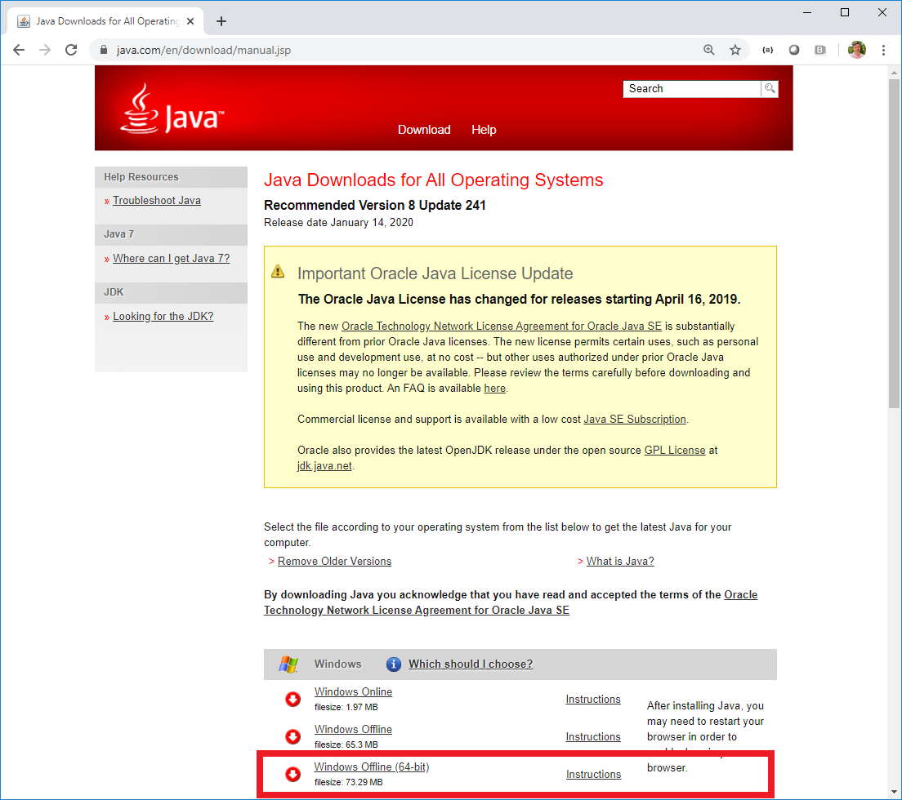

No site acima, faça o download, preferencialmente, da opção `Windows Offline (64-bit)` e, em seguida, prossiga à instalação a partir do arquivo baixado ([jre-8u241-windows-x64.exe](https://javadl.oracle.com/webapps/download/AutoDL?BundleId=241536_1f5b5a70bf22433b84d0e960903adac8)).

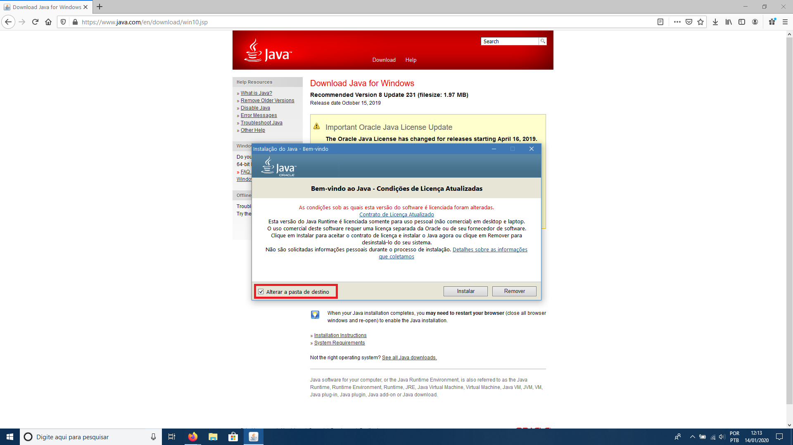

## Apache Tomcat

Com o Java instalado, acesse o [site do Tomcat](http://tomcat.apache.org/) e selecione a opção de download da versão 9:

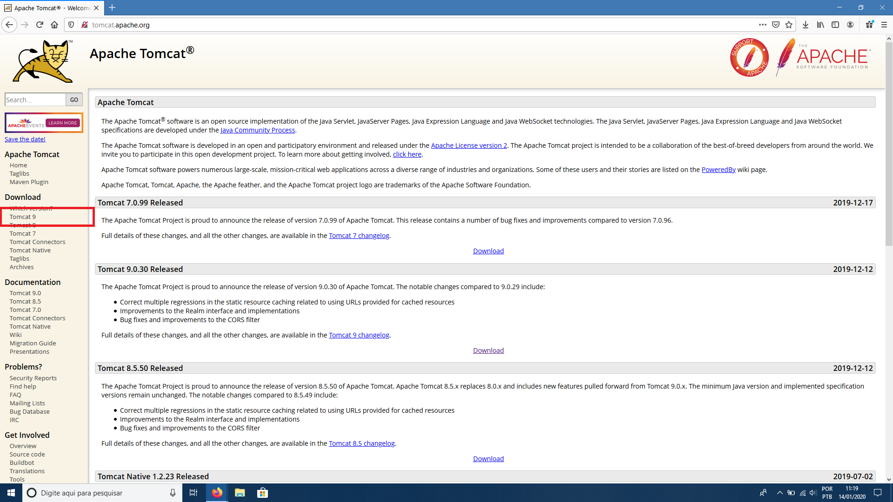

Na página de download do Tomcat, selecione a opção [32-bit/64-bit Windows Service Installer](http://ftp.unicamp.br/pub/apache/tomcat/tomcat-9/v9.0.30/bin/apache-tomcat-9.0.30.exe):

Após concluir o download do instalador, siga os passos mostrados a seguir:

**1.** Abra o instalador. Uma janela com o logo do Apache Tomcat será apresentada. Pressione `Próximo` para continuar:

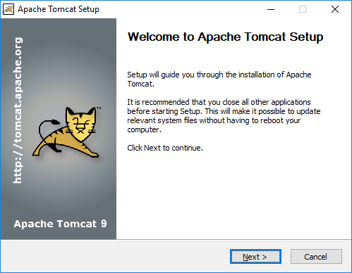

**2.** Você deverá aceitar a licença do Apache Tomcat pressionando `Eu Concordo` para continuar:

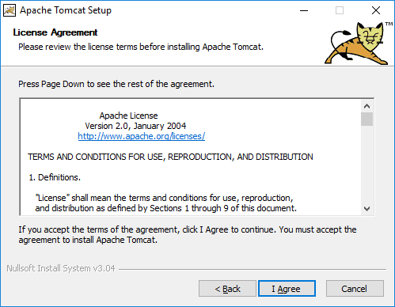

**3.** Deixe os componentes como recomendado por padrão. Pressione `Próximo` para continuar:

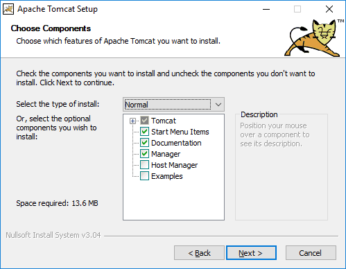

**4.** Deixe também as configurações como recomendado por padrão. Pressione `Próximo` para continuar:

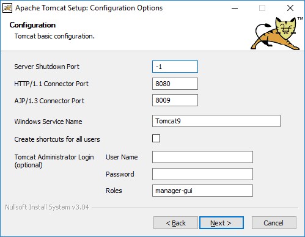

**5.** Selecione a versão do Java a ser utilizada pelo Apache Tomcat. Certifique-se de indicar a versão instalada no início do documento. Pressione `Próximo` para continuar:

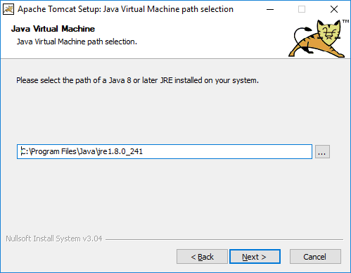

**6.**  Se você possui um disco SSD de pequeno porte, sugerimos alterar o local da pasta de destino do Apache Tomcat para um disco com maior capacidade. Aponte para a pasta desejada e pressione `Próximo` para continuar:

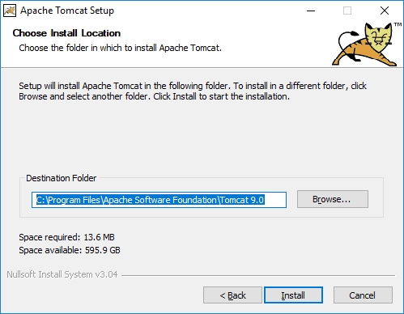

**7.** Essa janela mostra apenas que o processo de instalação encontra-se em progresso:

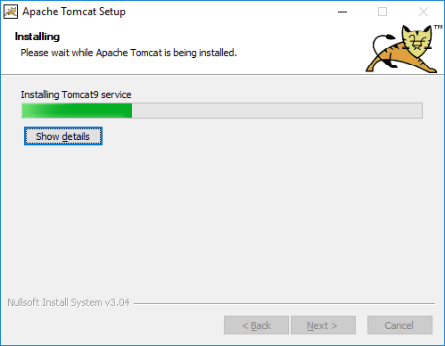

**8.** Ao final da instalação uma janela como mostrada abaixo será apresentada. Pressione `Terminar` para finalilzar a instalação:

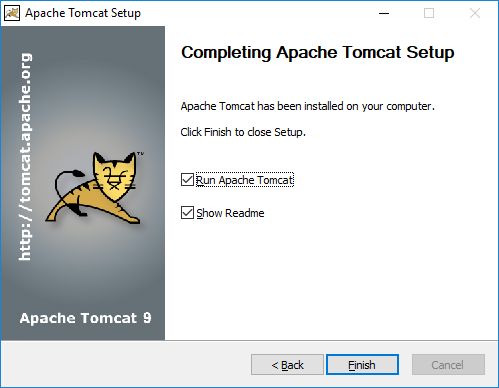

**09.** Verifique se a instalação foi concluída com sucesso. Para isso, acesse o seguinte endereço no seu navegador: http://localhost:8080/. Se o procedimento tiver sido realizado corretamente, será exibida uma página como a mostrada abaixo:

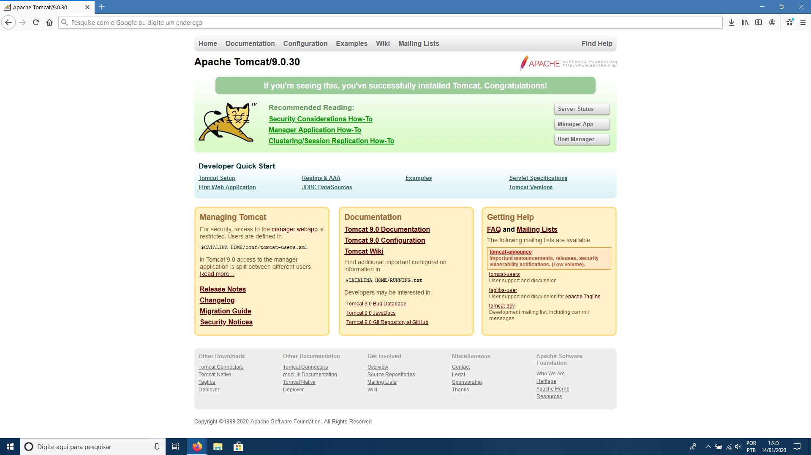

## Configuração do Tomcat

Para uma melhor experiência com os aplicativos GeoServer e GeoNetwork, que serão instalados a seguir, recomendamos algumas modificações nas configurações do Apache Tomcat.

**01.** Interrompa o serviço do Apache Tomcat. Para isso, clique com o botão direito do mouse sobre o ícone do Apache Tomcat na barra de tarefas do Windows e selecione a opção `Stop service`:

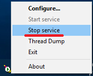

**02.** Com o serviço interrompido, clique novamente com o botão direito do mouse sobre o ícone do Apache Tomcat, selecionando a opção `Configure...`:

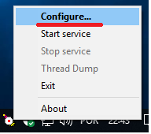

**03.** Na janela apresentada, selecione a aba `Java`, conforme indicado na figura abaixo. Nas opções que controlam a quantidade de memória utilizada pelo aplicativo, `Initial memory pool` e `Maximum memory pool`, redefina os valores de acordo com uma das tabelas mostradas abaixo da figura e em seguida aplique e confirme as modificações.

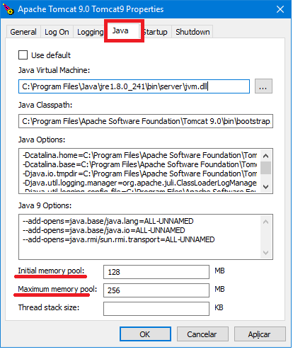

Se seu sistema possuir 8GB ou mais de memória RAM, utilize os seguintes valores:

| Initial memory pool 	| Maximum memory pool 	|
|---------------------	|---------------------	|
| 2048                	|  4096               	|

Se seu sistema possuir 4GB de RAM, utilize os seguintes valores:

| Initial memory pool 	| Maximum memory pool 	|
|---------------------	|---------------------	|
| 1024                	|  2048               	|

**04.** Após realizar as modificações, reinicie o serviço.

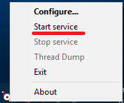

Pronto! O tomcat foi configurado!

Mais informações sobre a instalação podem ser encontradas em: [Apache Tomcat](http://tomcat.apache.org/).